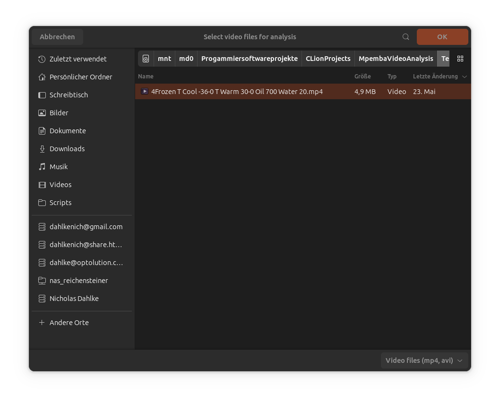
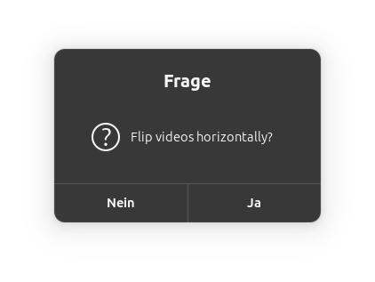
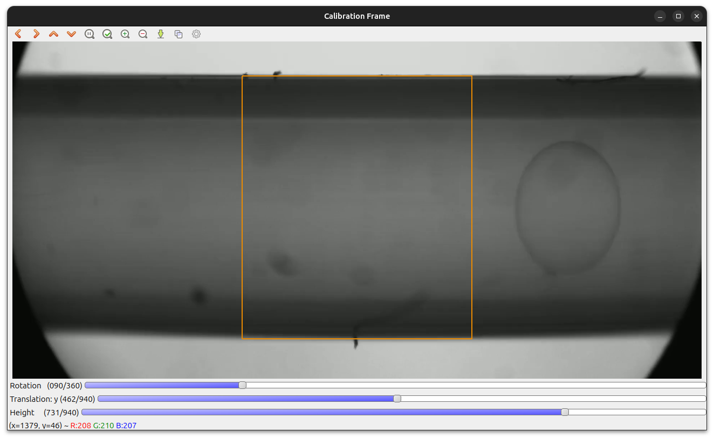
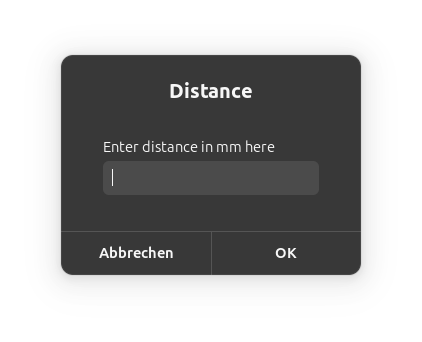
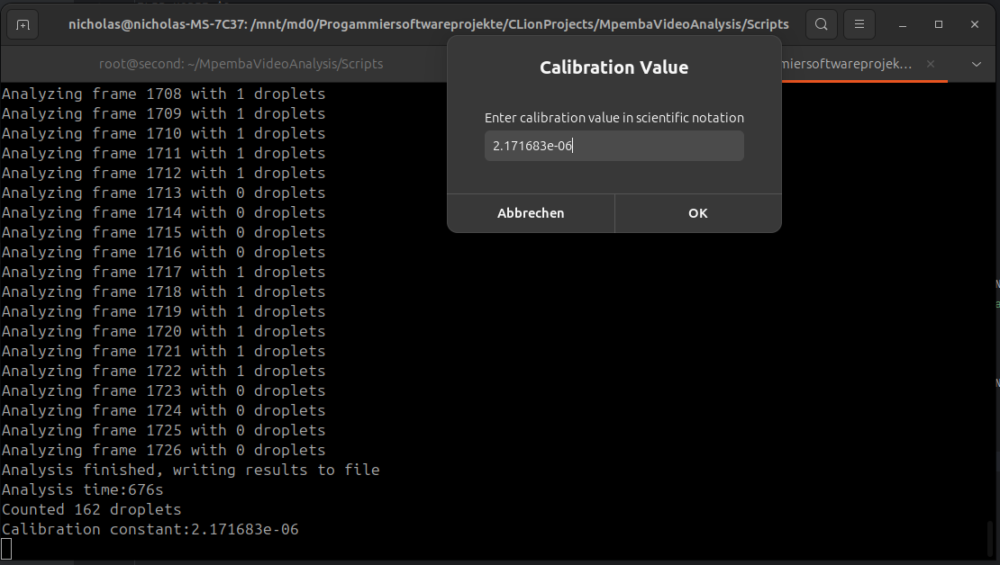
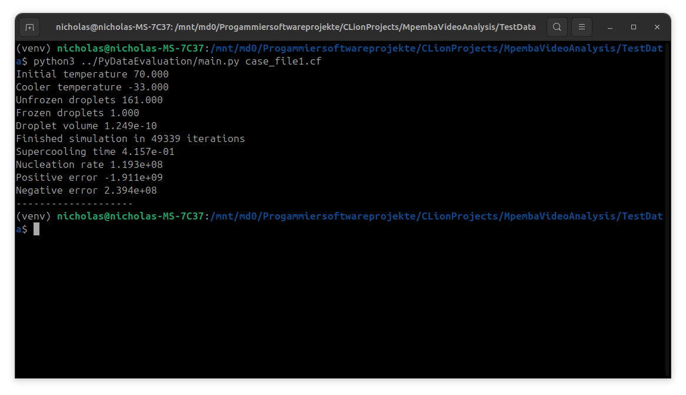

# KI löst Chemierätsel - der Mpemba-Effekt

## Struktur der Software
Die Software hat zwei Hauptbestandteile:
1. Videoanalyse
2. Nachbereitung

In der Videoanalyse werden dabei je ein Video eingelesen und ausgewertet. Hierbei werden Parameter wie Tröpfchenvolumen oder Tröpfchenanzahl extrahiert.

Diese Informationen werden in mehrere *.csv* Dateien exportiert, die jeweils anhand von Videodateiname und dem ausgegebenen Parameter benannt werden.

Die weitere Analyse erfolgt in einer Python-Software. Die erforderlichen Daten werden dazu über eine Datei (Case-File) angegeben. 
Beispielhaft ist die Struktur einer Datei dargestellt:


```toml
[data]
video = "TestData/Frozen T Cool -33-0 T Warm 70-0 Oil 700 Water 10.mp4"
date_recorded = "2024-03-28 13:27:00"
flow_rate_oil_ul = 700.0
flow_rate_water_ul = 10.0
frames_per_second = 48.79
initial_temperature = 70.0
cooler_temperature = -33.0
cooler_length = 0.07
thermal_conductivity_tubing = 0.25
inner_radius_tubing = 4.0e-4
outer_radius_tubing = 7.9375e-4
water_density = 997.0
```
Die Python-Software unterstützt dabei die automatische Verarbeitung von mehreren Dateien.
Dazu werden diese als Argument angegeben.

## Installation
Allgemeine Installation der Abhängigkeiten auf Ubuntu:
`sudo apt install build-essential cmake git libgtk2.0-dev pkg-config libavcodec-dev libavformat-dev libswscale-dev libopencv-dev python3 python3-pip python3-venv zenity`

### C++ Videoanalyesoftware
1. Klonen des Github-Repository mit dem Code
    
    `git clone https://github.com/nicholasdahlke/MpembaVideoAnalysis.git`


2. In den Ordner mit dem C++ Code wechseln

    `cd MpembaVideoAnalysis/VideoAnalysis`


3. Einen Build-Ordner erstellen

    `mkdir Release`


4. In den Build-Ordner wechseln

    `cd Release`


5. Build Dateien mit *cmake* erstellen

    `cmake -DCMAKE_BUILD_TYPE=Release ..`


6. Projekt kompillieren

    `make`

Die Software ist nun in dem Ordner `Release` als ausführbare Datei `MpembaVideoAnalysis` zu finden.

### Python Auswertungssoftware
1. In den Python-Ordner wechseln

   `cd ../../PyDataEvaluation`


2. Python *venv* erstellen

    `python3 -m venv .venv`


3. *venv* aktivieren

    `source .venv/bin/activate`


4. Abhängigkeiten installieren

   `pip install -r requirements.txt`

Die Software kann nun mit `python3 main.py <casefiles>` ausgeführt werden

## Nutzung der Software
Die Software wird über ein Bash-Script aufgerufen, welches die simplere Abarbeitung von mehreren Videodateien ermöglicht.
Nach der Installation wird dazu in den [Scripts](Scripts) Ordner gewechselt

`cd ../Scripts`

Mit `./analysis.sh` kann dann die Videoanalyse geöffnet werden 
Es öffnet sich anschließend ein Fenster, in welchem die zu analysierenden Datein ausgewählt werden können.

In dem Ordner [TestData](TestData) ist eine Beispiel-Videodatei bereitgestellt.

Anschließend erfolgt eine Nachfrage ob das Video horizontal gespiegelt werden soll.
Dies ist nur notwendig, wenn die Tröpfchen nicht nach rechts fließen, bei dem Beispielvideo also nicht.


In dem sich daraufhin öffnenden Fenster muss zur Längenkalibrierung ein Rechteck, mithilfe der Schieberegler, an die Außenwand des Schlauches angepasst werden.
Dies ist auch im Bild dargestellt.

Diese Auswahl wird mit <kbd>ENTER</kbd> bestätigt.

In dem folgenden Feld muss die reale Länge der ausgewählten Schlauchsektion angegeben werden. Diese ist hier 1/16", es muss also 1.5875 in das Dialogfeld eingegeben werden.
Die Einheit mm darf nicht mit angegeben werden.


Nachdem dieses Feld mit Ok bestätigt wird, wird die Software automatisch ausgeführt und beendet sich automatisch nach Abarbeiten aller Dateien.

Werden mehrere Dateien bearbeitet, so muss nach Ablauf der ersten Datei der angezeigte Kalibrationswert eingegeben werden.


Danach werden automatisch die Ausgabe-Dateien erstellt.

Diese befinden sich im selben Ordner wie die Videodatei, es empfiehlt sich also für jeden Durchlauf einen neuen Ordner zu erstellen.

Zur weiteren Verarbeitung sollte also als nächster Schritt in den [TestData](TestData) Ordner gewechselt werden.

`cd ../TestData`

Hier liegt bereits ein passendes Case-File für das Beispielvideo vor, ansonsten müssen diese aktuell noch manuell erstellt werden.
Die Datenanalyse kann daher mit `python3 ../PyDataEvaluation/main.py case_file1.cf` gestartet werden.

Die Ausgabe im Terminal ist nun das finale Resultat. 


Interessant ist hier vor allem die Nukleationsrate, dieser Parameter ist bisher nur sehr kompliziert und ungenau bestimmbar, was durch diesen Aufbau deutlich verbessert wird.
